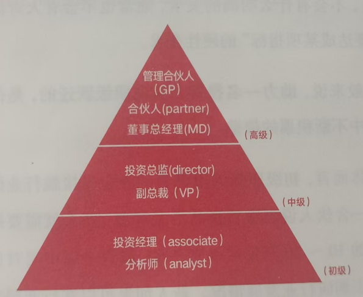

# 《我能做投资人吗》阅读笔记

## 零、初印象：投资人的工作是什么
首先，投资人的全职工作就是投资。在本职工作之外购
买股票或者基金的个人投资行为，不在我们的讨论范畴之内。
其次，他们的投资方式是私募股权投资。换句话说，他们购
买的是尚未在股票市场上市交易的公司的股权。从事股票等
证券交易的职业投资人，也不在我们的讨论范畴之内。最后，
他们的投资标的主要是初创期和成长期的公司。那些面向已
经发展到较成熟阶段甚至Pre-IP0（上市前期）阶段的企业进
行投资的投资人，同样不在我们的讨论范畴之内。

**_投资人很小众！_**

先来看投资人在资产管理行业的位置：其一，他们以买
入公司股权的方式进行投资。相对于主流的债权投资，它很
小众。其二，他们面向非上市公司进行投资。相对于占大头
的上市公司的股权投资，它很小众。其三，他们是面向早期
和一部分成长期的公司投资的。相对于大多针对成熟期企业
的投资，它很小众。

## 第一章、行业地图

### 1.1 投资人会以怎样的眼光看项目

不同投资阶段对应的公司发展情况，你可能已经略知
一二了：天使轮阶段，通常是一个创业者站出来说自己有一
个新想法，或者是持有一种新技术，但尚未得到市场验证。
我们总开玩笑说，这个时候只有“3F”一Friend（朋友人
Family（家人）和Fool（傻子）一愿意站出来支持创业者。
能够走到A轮的公司，它研发的产品通常已经有了原型，团
队也小有规模了。B轮左右的公司，它不仅可以持续产出产
品，也在相应的市场找到了客户。到C轮的话，公司一般已
经确立了商业模式，并开始进行复制和扩张…

成长股投资策略之父菲利普·费雪(Philip Fisher)曾说，
投资目标应该处于持续成长中，增长率应该高于整体经济的
增长率。没错，宏观经济环境的变化和企业增长有很强的关
联性，即便在风险投资领域也是这个道理。具体来说，早期
以及快速成长期企业的增长速度必须达到GDP（国内生产总
值）增速的4倍以上。比如，2015年，中国GDP的增速为
6.9%,当时某行业很多公司的增长率能达到100%，远远超过
了GDP增速的4倍，说明这类公司当时就处于快速成长的状
态。反之，如果一家公司的增速稳定在10%左右，这个速度
远远小于GDP增速的4倍，从理论上推断，它已经进入相对
成熟的状态，也就很难被纳入风险投资的范畴了。

### 1.2 投资人有哪些区分

若想了解其他做风险投资的群体，我们先要清楚的一点是，
风险投资行业的从业人员里有财务投资人与战略投资人的区
分。在私募股权基金工作的，大部分是财务投资人。除此之外，
还有一类被称为战略投资人的人群在其他类型的机构工作。

你肯定听说过腾讯、阿里巴巴等公司宏大的投资版图。没
错，战略投资人主要是这部分在BAT(百度、阿里巴巴、腾讯)
等非金融企业的投资部门，抑或独立出来的投资公司工作的投
资人。战略投资人不以“给出资人，也就是母公司带来收益回
报最大化”为唯一目标。他们主要围绕母公司的战略进行投资
布局，以创业创新的力量反推母公司发展，巩固其市场地位。

本书介绍的重点，财务投资人。财务投资人无法
背靠一家非金融企业进行投资。他们首先需要向几位出资
人，也就是所谓的LP(Limited Partner,受托管理出资人)募
集款项，成立一只基金，并在资金存放期限内通过股权投资
为LP带来理想的回报。我们一般认为，增值是财务投资人
的主要诉求。

因为每位LP对投资阶段和周期的
兴趣都不大一样，所以财务投资人需要预先与LP约定好
些条件。比如，答应LP这只基金主要做成长期投资以后，天
使轮的项目就不在投资人的射程范围内了。再比如，答应LP
基金周期为5年，投资人一般也不会去关注那些成长周期特
别长的项目了。相较于战略投资人，财务投资人需要提前考
虑到这部分约束条件

### 1.3 投资人的工作究竟多复杂

这份工作实质上不就是低买高卖吗？看重公
司潜在的价值成长，在公司估值低于其实际价值时买人，未
来在公司估值高于其实际价值时卖出。

当然不是。风险投资的逻辑远没有这么简单，它背后是
一个复杂的系统工程。

识别公司和创始人的品质

计算公司估值

准确把握买卖时机

这些都是投资人需要在做出
投资决策前完成的，而且每一件事都不容易。

识别公司的品质为什么复杂？很多创业公司找到投资人时，只有一个粗糙得像单细胞生物的产品。你要在信息极其
有限的情况下，对它所在行业未来的成长空间，以及它潜在
用户的需求做出判断。当然，这些判断还要跑在市场普遍认
知形成之前。

识别创始人的品质为什么复杂？创业需要考察创始人多
方面的能力，比如，能不能把握屋行业未来的发展趋势，能不能
开放地向同行、团队成员取经，能不能特续把优秀人才招至
麾下，等等。你需要在相对有限的沟通中评判创始人的综合
实力。毕竟，不管上述哪一个维度的事情没做好，都会影响
被投公司后期的运营、管理。

计算估值为什么复杂？早期投资项目的估值存在很大
的弹性，较难有规则可循。如果一家公司处在某个新兴行
业，或者采用了某种新的商业模式，就很难在市场上找到合
适的公司去对标和估值，即投资中的相对估值法'(Relative
Valuation Approach)很难适用。
如果这家公司未来的现金流较难准确预测，绝对估值法2(Absolute Valuation Approach)中的现金流折现模型就也难以适用。

> - 1.相对估值法——使用市盈率、市净率、市售率、市现率等价格指标与其同行或竞
争对手（对比系）进行比较，根据对比系的平均估值水平来判断投资项目的估
值水平。
> - 2,绝对估值法——将投资项目未来的所有现金流都折现到现在，将这些折现
值加起来，就可以获得投资项目的估值。

把握买卖时机为什么复杂？我们常说，一家好公司不一
定是好投资。即便是再好的公司，你进早了也容易成为“先
烈”，进晚了则有可能失去创造超额收益的机会。投资人在什
么时候“下注”，是一道需要综合产品、需求、业务模式、团队
等诸多因素来判断的考题。

**_投资人很大程度上挣的是认知的钱_**

### 1.4 投资人想升职主要靠什么

投资行业的职级体系如下：

**_般来说，助力一名投资人实现职级跃迁的，是他在工作过程中不断积累的信誉。_**

具体而言，初级职级的投资人一般会先接触行业研究的
工作一合伙人说想看看食品消费赛道，新人就需要把这个
行业里的10~20家公司研究一遍，或者是以中美对比研究
的方式去调研行业发展情况。新人如果可以在行业研究中提
取出一些合伙人、创业者没有注意到的观察视角，就能获得
部分继续推进项目的信誉。在2011年的移动互联网创业
大潮中，就有不少年轻的投资经理先于行业前辈把握住了移
动互联网的底层逻辑，成功开启了上升通道。

在此之上，中级职级的投资人如果有幸摸到了行业内某
个明星项目，或者他主导的某个项目不幸被投资决策委员会
(后文简称“投决会”)1“枪毙”，事后却被验证发展得很不错
（后一种情况更加常见），也能增加他的信誉，将他送至更高
的职级。

### 1.5 投资人的工作风格

人们误以为投资是一门艺术，投对项
目靠的是艺术般的投资感悟。但我要告诉你，风险投资从来
不是一门艺术，也不是只有拥有慧眼识珠般天赋的人才能从
事的职业。绝大多数情况下，**_风险投资是一种高纪律性、重复性的工作。_**

好的投资人都是通过长期做研究、看项目、见创始团队，
逐渐锻炼出来的。虽然投资能否成功取决于很多不可控的因
素，但我们不能将风险投资看成一门艺术。富有纪律性地聊
项目、做研究，才是投资人真正的工作风格。

### 1.6 投资决策的机制

在机构的投资决策流程中，有一个非常重要的环节：机构
有意向投资的所有项目都要在投决会上讨论。顾名思义，投
决会就是机构内部决策投资事项以及退出事项的议事机构。

投决会需要参会人员全面地看待问题，
对项目形成一个综合判断。

在《苏世民：我的经验与教训》一书中，苏世民（Stephen
Schwarzman）也介绍了投资机构黑石集团内部反复迭代而成
的投资决策流程。我们做了摘录，供你参考：

> - 不让某个人总揽一切、独自批准协议；

> - 所有高级合伙人必须参与投资讨论，运用集体的智慧
来评估投资风险；

> - 任何提案都必须以书面备忘录的形式提交，并至少提
前两天提供给参会人员；

> - 除非有重大的后续发展，否则不得在会议上对备忘录
进行任何补充；

> - 要把讨论重点放在潜在投资机会的缺，点上，每个人都
必须找到尚未解决的问题。

### 1.7 投资人的薪酬有多高

清科创业旗下的清科研究中心曾调研过
市场上有活跃融资记录的300家股权投资机构，并生成了
《2020年VC/PE机构薪酬与运营机制调查研究报告》。报告
显示，VC/PE机构里各职级从业人员中等工资水平（中位数）
分别为：1.5万元(分析师/研究员)2万元（投资经理3
万元（投资总监）和5万元（合伙人及以上）'。值得注意的是，
由于具有马太效应，头部机构能够获得更多的项目和更高的
收益，头部机构从业人员的薪酬自然也要远高于行业平均
水平。

工资组成：

风险投资机构发放的薪酬通常来自LP资金产生的管理
费。这笔费用一般每年按2%的比例收取，用于投资机构日
常运营。举个例子，一只资产管理规模为2亿元的基金，每
年可以收取400万元的管理费。扣除掉日常办公场地租赁和
差旅等的费用以后，剩下的管理费就是落在机构内部每一个
工作人员上的薪资。可以想见，在基金的资产管理规模较小
的情况下，机构发放给投资人的报酬自然不会特别高。

不过，一家投资机构也不太可能光靠管理费运作。在管
理费之外，投资人如果能为LP带来不错的回报，就可以分享
其投资收益的20%~25%。我们通常把这笔收益叫作业绩
报酬(Carried Interest,一般简称Carry)

只是，业绩报酬一般要等到基金投资的公司退出清算或
者基金到期时才能拿到，而被投公司退出或者基金到期的周
期中位数在6~7年。其间，如果你在一家投资机构入职，
若想分到业绩报酬，怎么着也要等上五六年。

若投资人从机构离职，只有不到四成可以获得分配的业绩报酬。

值得注意的是，我国主流的基金里面主要有两种分配业
绩报酬的方式：一种是按基金内部不同项目的表现分配（Deal
Camy）,另一种是按基金整体的收益分配(Fund Carry)。具体
来说，假设有一只资产管理规模为9亿美元的基金，第一种
分配方式相当于按投资人单笔投资，比如投资一个4000万美
元的项目未来可能产生的收益来计算业绩报酬；第二种分配
方式则要等到整个基金实现收益以后再去给每位投资人分配
业绩报酬。由于不同项目的退出时间会有一些差异，这两种
分配模式下，投资人拿到业绩报酬的时间也会有较大区别。

看到这里，你应该已经认识到了，风险投资取得回报没
有想象得那么容易。诚然，这份工作能带给你优于普通人的
薪酬。但若想拿到超额的业绩报酬，你需要凭借卓越的项目
研究、找人识人和趋势预判能力，为LP带来理想的回报，并
在这家机构待足够长的时间。

### 1.8 投资人会遇到什么挑战

第一，如果你在互联网公司做运营，通常会有很多团队
作业。但是，绝大多数投资人都是要单打独斗的。即便机构
内部设有几个行业小组，一般也就是“合伙人+分析师”的小
团队。而且，当分析师成长为投资经理后，小团队也要逐渐
剥离开来工作，这样机构可以在同一时间看更多的创业项目
如果你尚未习惯独立思考行事，风险投资这行对你来说就非
常有挑战性了。

第二，互联网公司的运营工作可控性比较强，上级交代
的大部分任务都会在你的能力范围之内。风险投资则不然。这首先是因为投资人很少会参与被投企业日常的运营，他们
对企业的掌控力是很有限的。其次，当投资机构希望关注
个新赛道时，投资人常常要做一些自己能力范围以外的研究
工作。也就是说，新人对日常工作没有那么强的主动权，失
控感也是你在入行后需要面对的挑战之一。

第三，互联网公司日常的运营工作，像是策划一款产品
上线的方案、调研用户习惯等，可以较快得到市场反馈。投
资人平日却很难接收到这种小额、多频次的刺激。相反，投
资一个项目可能会为投资人带来巨额回报，只是，这份回报
肯定是严重滞后的。这和我们的预期恰恰相悖。就像人格心
理学家沃尔特·米歇尔(Walter Mischel)组织的棉花糖实验
中，很多孩子倾向于立即得到糖果奖励，而不是等待一段时
间以后获得更多的奖励，风险投资工作带来的“延迟且不一
定实现的满足”显然有违人的天性。这也是投资人需要面对
的挑战之一。

**_投资人不仅要把一个人活成一支队伍，还要直面工作中的失控感以及反人性的部分_**

## 第二章、新手上路

### 2.1 怎样判断自己是不是适合

现实生活中切实存在一个问题——个人想进入
风险投资这个行业，他如何判断自己是否适合干这行呢？我
的建议是，想办法去认识五个投资人。这是因为对于一项不
了解的事情，人是很难说自己热爱或者想加入的。不认识那
么一小撮投资人，你怎么去了解投资人的生活状态、工作状
态，以及他们每天都在做什么？而如果什么都不了解，你为
什么想做投资人呢？

同时，想办法认识五个投资人的过程，跟投资人找创业
者、找项目的过程是极其相似的。作为投资人，看到一个感
兴趣的项目，就要通过各种途径去联系项目创业者。对方可
能愿意见，也可能不愿意见；如果不愿意见，你还要绞尽脑汁
想出各种各样的方法。如果不愿意为了进入这个职业付出努
力，那么你是否适合做投资人，这个问题的答案就是显而易
见的了。

### 2.2 投资人一定要有金融背景？

**_NO！！！_**

我觉得有这样一个原因：**_投资人最关键的能力，是通过研究判断一个项目的优劣。_**财务、金融等专业练就的科班手
艺，比如根据财务报表评估可投性，参考经济模型估算未来
走势等，在评估初创公司孰优孰劣这件事上没有太大的帮助
在风险投资领域，越是早期的公司，能够参考的财务数据就
越少。反之，那些有工程师或者产品经理背景的投资人对技
术和产品的认知能力，以及那些有商业记者背景的投资人在
创业圈里的社交能力等，在判断一家初创公司是否值得投时
更有帮助。

### 2.3 想成为投资人，大学毕业就要入行吗？

**_NO！！！_**

我们来看看在风险投资机构初级岗位工作的都是什么
人：他们有的刚拿下MBA（工商管理硕士）学位，有的已经在
创业公司工作了一段时间，还有的在投资银行'接受过基本的
财务训练。在这些投资新人中，鲜少有应届生。为什么会出
现这种情况呢？

首先，投资本身不是劳动力密集型行业。投资机构招
聘新人，一般是老人离开需要新人填补，或者是某个行业出
现新机会，得有看得懂项目的人入伙。所以，多数投资机构
每年的人才缺口都不大，也不需要海量“捕捞”人才的校招
环节。

其次，投资是一项非常综合的业务。后文会介绍到，投
资人要先人一步看清一家公司真正的价值，要具备行业研究
能力，当然也要懂得财务、法务方面的专业知识。而且，投
资机构并不打算将人招进来以后慢慢培养。更多时候，它们
要求新人在进来之前就把基本功练好。打个不那么恰当的比
方：投资这座庙堂的地基要打四根桩，而很多机构对新人的
期待是在入行前先自己打完两根半桩，有个好底子在。如果
连半根桩都没打好，就误打误撞地进这个行业，新人会很痛
苦，机构也是。

更进一步说，投资还是一件“近人”的事儿。选中行业
内最适切的创始人，非常考验你找人、识人的能力。老话讲，
“世事洞明皆学问，人情练达即文章”，而我们在学校接受的
教育以知识输入为主，鲜少涉及对人性的理解。因此，作为
一个应届生，没有在实际工作中与不同的人广泛交往过，不
懂得如何找人、识人，也就很难在投资机构里生存下来。

如果你有志于成为投资人，可以先在相关行业磨炼好基本
功，保持尽可能广的社交面，之后再来敲投资人这一行的门。

当然，应届生也不是完全没有机会进入投资机构。很多
大学生在毕业前会到投资机构实习，如果表现优异，就有被
留用的机会。

### 2.4 想成为投资人，可以从哪些方向开始？

前文说到，风险投资领域的新人很少有应届毕业生，因
为这是一个比较综合的职业，既需要你有非常理性的一面，
能够洞察商业社会的本质，能够去收集各种信息并加以分析
也需要你有非常感性的一面，能够高效地与人沟通。**_我认为年轻人可以试着从投资银行、FA机构和战略咨询公司这三个方向做起，积累入行经验。_**

#### 投行
投资银行简称“投行”，它是一种金融中介机构，负责连
接资产和资金两头，让企业获得更好的金融资源配置。其业
务的主要切入点是为融资方和投资者服务。在某些时候，投
行也可以作为投资者参与到交易活动中。在投行工作一段时
间后，你会对金融世界的运行方式有一定的了解。

#### FA机构

在中国，有一类特殊的投资银行，那就是FA机构。FA
在初创企业和未上市企业的融资服务业务中发挥着重要作
用，因为它扮演了促成投资人与企业达成合作的财务顾问角
色。换句话说，FA要给投资人提供项目，给项目方找投资，是创业者和投资机构之间的中间人。在FA机构工作一段时
间，你能更近距离地接触投资人和具体的项目，了解他们工
作的底层逻辑。

#### 战略咨询公司

战略咨询公司是帮助企业解决生存和发展问题的公司，
它们会根据企业的需求，为其制定未来一定阶段内的目标
任务、政策等。在战略咨询公司工作一段时间后，你会对企
业的发展情况及其面临的问题有更清晰的认识。

虽然从一些具体的行业也可以转行成为投资人，但值得
提醒的是，这需要一定的契机。比如，这两年人工智能生成
内容(AIGC)领域很热，如果你有相关技术背景，还有项目
资源，那么想转行成为投资人并不是难事。毕竟，投资机构
也需要一些看得懂新领域、新项目的新鲜血液加入。但如果
你从事的行业并不是投资机构目前正在关注的那儿个投资方
向，你的转行之路就会比较艰辛。

### 2.5 想成为投资人，需要具备什么特质？

第一，独立思考的能力。

这种能力在面试过程中就能有所体现。面试时，我通常
不会问候选人“你对新能源行业有什么样的认识”，或者“你
对农业产业有什么了解”之类的问题，因为对这类问题的回
答可能并不是他自己独立思考的结果，而是他的老师研究出
来告诉他的，或者是他从某个地方看到的。

第二，利他主义精神。

这里说的利他主义精神，是指在做事情时，一个人本能的
出发点是能对周边的人或这个世界产生更好的影响。当然，
并不是说一个人有利他主义精神就能做好投资，但这样的人
一定是善于合作的，能给团队带来非常大的正面影响。此外，
从更长期的角度来说，这样的人能接触的资源也是更多的。

第三，好奇心。

投资人是一个需要不断学习新知识的职业，只要从业
天，就要学习新的知识和行业。这是因为投资人需要不断
变换投资赛道一随着社会和商业环境的不断变化，原来熟
悉的赛道可能不会再有好机会了，这时必须有学习能力和学
习意愿，去了解一个新的行业。比如，现实中很多原来投互
联网的投资人就转换赛道去投消费、医疗或者硬科技了。面
对这种学习需求，如果没有好奇心，就会在工作中感到非常
痛苦。

### 2.6 想成为投资人，有哪几种机构可以选择？

一般来说，投资机构会按以下两种形式去组织投资人的
日常工作。

第一种，无论是初级职级还是高级职级的投资人，都有
机会主导完成从投资、投后管理到退出的流程。不同职级的
投资人都有可能在项目退出或者基金存续期到期后分到业绩
报酬。

第二种，初级职级的投资人负责搜集项目，并在机构内
部推动针对项目的投资。价值判断，也就是决定到底投不投
的工作，则交给高级职级的投资人去做。至于利益分配，由
于最后价值判断的结果是老人在背，如果这个项目赚钱了，
老人会拿到一大笔业绩报酬。有的机构为了鼓励新人的工
作，会设置“前端奖金”一只要推荐的项目过了立项会，新
人就可以拿到一笔钱。但不是每个机构都会设置这种“前端奖金”，具体还要看各个机构自己的规定。

这两种方式都能保证机构运转良好，其差异主要体现在
机构内部不同职级投资人的分工上。

投资新人做出第一份成绩，肯定是因为找到了一个好项
目。如果在采用第一种组织形式的投资机构工作，那么在找
到好项目后，你有机会陪伴企业成长。如果在采取第二种组
织形式的机构工作，那么你可能需要长时间地做项目收集工
作。机构对你的考核通常也是基于你一个季度往立项会上推
了多少个项目。

组织形式会深刻地影响员工的工作方式。你应该已经注
意到了，在这两种组织形式下工作的新人得到锻炼的能力有
一定的差异，分别是“找到值得投资的公司”和“找到适合推
上投决会的公司”。

这两种能力没有什么高下之分。很多投资新人在找到值
得投资的公司之前，也需要关注其他投资人往立项会上送的
项目是怎样的。但有一点要提醒你，在第二种机构中，因为
领导考核新人的方法往往是基于他往立项会上推了多少个项
目，所以有的新人可能会在考虑项目本身的价值之外，去迎
合市场上的风口和合伙人看项目的偏好，甚至有可能在尽职
调查里注水，让项目表现得更能过立项会。

在短时间内，上述做法可能会给你带来一定的收益，但
从长期来看，这会让你形成不好的工作习惯，不利于你的
发展。

除了了解投资机构的组织形式，王冠珠还建议，在选择
机构时，一定要将目光聚焦在那些头部机构上。

投资人的职业成长路径并不像其他行业那样可以通过跳
机构的方式实现。这里说的跳机构，就是指从一家名不见经
传的小机构跳到小有名声的机构，再跳到业内顶尖机构。投
资行业的投资端以及募资端有显著的顶端优势，这意味着顶
端机构内部有足够多的项目机会，以及足够大的发展空间
助你成长。有机会的话，你还是要先尝试业内这些顶尖的平
台。关于这些平台，我们在第六章“行业清单”章节有列举和
介绍。

此外，你还可以把目光放在那些规模可能没有顶尖机构
那么大，但在细分领域下投得非常好的机构上，看它们与你
关注的领域是否有重叠。

### 2.7 怎样从导师身上学到有用的知识？

要知道，一级市场的公司发展往往都是以5年、10年为单位
的，如果几年之后才发现投资的公司有问题，这种反馈周期
对自主学习来说无异于灾难。

投资行业有一个显著特点，就是投资人相互之间的分工
协作非常少，基本上一个人就可以把所有事情做完。对于你
的导师来说，如果他愿意主动教你怎么工作，那自然最好。
可如果他没有主动教你的意愿，你又能怎么从他那里学到东
西呢？

我认为，最好的方法就是认真学习导师如何提问。我经常限我带的新人说，如果跟着我去开会，可以试着自己在心
里提问题，如果发现我提的问题你大部分都想到了，那你就
已经学到七八成了。当然，有了这七八成的功力之后，你还
要付出很多努力，只有这样才能做出综合分析来决定一个项
目是否值得投资。

此外，我还会要求新人把问题模板化，让他们整理出针
对不同行业的投资人的提问提纲。这样做不是为了让他们下
次遇到相关创业者就按这个提纲一个一个地问，而是为了让
他们在列提纲的过程中重新思考一下，什么样的问题对这个
行业是有效的。

你可以把新人阶段的这两个里程碑记下来。

第一个里程碑是，你发现在见创业者时，导师提出的问
题，你自己也能提出其中的大部分

第二个里程碑是，当你和导师开完会后，你能知道这个
会议的结果是什么，也能知道这个项目到底靠不靠谱。当你
刚进入这个行业时，每见完一个创业者，你都会面临导师的
提问，你可以告诉导师自己对这个项目的看法。一开始，你
对项目的判断可能是犹疑的、不准确的；但一段时间之后，你
对项目的看法会变得明晰起来，判断也会越来越准确。

### 2.8 项目研究要从哪几个方面展开？

#### 2.8.1 选择赛道：找准细分市场远比忙找项目重要

如何在一个大的行业里选择细分行业呢？要先基于经验和直觉做一些与行业大类相关的假设。有效的分类可以告诉你真正的大机会可能在哪里，并排除掉不具备机会的其他细分领域。

首先找到可能出现大公司、大机会的领域，然后再在那里挖掘，最后进行比较。

#### 2.8.2 调研需求：少数人的现有需求比较好切入

怎么理解自下而上分别
代表的“现有需求”和“新需求”呢？现有需求是已有解决方
案的显性需求。比如，打车就属于现有需求，网约车的出现
是建立在现有需求之上的。新需求是还没有解决方案，等待
被激发的需求，一旦有模式创新就会被激发。比如，以POp
MART（泡泡玛特）为代表的潮玩的出现，就激发了消费者的
新需求。

第一象限，即右上部分，多数人、新需求，其原生产品可
能本身就代表或者定义了技术革命，比如ChatGPT和iPhone.

第二象限，即左上部分，少数人、新需求，其原生产品主
要以品牌为代表，比如POP MART、喜茶等，这些创新往往定
义了一个新品类。

第三象限，即左下部分，少数人、现有需求。也许这些公
司最开始面对的是小众市场，但他们有机会通过改善产品，
逐步拓展到大多数人的市场（第四象限），获得商业上的巨大
成功。这个演变不是必然会发生的，甚至可能大多数情况下
不会发生，因此需要创业者做出非常多的努力。

第四象限，即右下部分，多数人、现有需求，其原生产品往往是由技术革命催生的，比如外卖平台。一日三餐是大多
数人一直都有的需求，而技术变革带来了新的商业机会，使
得像美团这样能解决多数人现有需求的公司涌现了出来。

从图中可以看到，这四个象限里都有比较成功的产品。
但我要提醒一点，少数人的现有需求，即第三象限可能是比
较容易切入的一个领域。

以我投资的一家公司“玩物得志”为例。国风文化电商
平台“玩物得志”覆盖了玉翠珠宝、木雕盘玩等八大品类的万
款商品。买珠宝文玩的需求古已有之，人群小众且固定，是
比较典型的少数人的现有需求。在文玩方面，中国有很多专
门卖古玩的地方，比如北京的潘家园和琉璃厂大街、西安朱
雀路古玩城、郑州送仙桥古玩城。这些地方人流量一直不低，
生意都非常红火。珠宝方面也是如此，我在调研时还发现了
一个很有趣的现象：我妈妈那一辈的人平日里非常节俭，平
时我要给她买什么东西，她都摆摆手表示不要，唯独要给她
买玉镯子，她欣然接受了。

但是，过去大部分文玩交易场景都局限于古玩城、旅游
景区、原产地等地，范围非常小，触达的人也比较有限。“玩
物得志”通过品类线上化，消化了线下效率不高的存量市场，
并通过高效的运营手段让少数人买文玩的需求慢慢演化为更
多人群可消费的国风品类的需求。比如，我妈妈这样的中老
年人被激发出来了戴玉饰的需求，喜欢国风的年轻人则被激发出了盘核桃和喝茶的需求。就在用户“人群和需求”匹配模型中完成了从第三象限到第四象限的转变。

#### 2.8.3 找到差异：选择带来结构性变化的解决方案
所以，投资人经常要面对这样的问题：一家公司的创始
人找到你，表示他可以提供比现有解决方案好10%的新方
案。比如，他手上有一个新配方，能生产出比可口可乐更好
喝的可乐，这种创业公司是好的投资标的吗？

答案是否定的。为什么这么说？来看一个公式，它可以
解释优化现有产品体验的逻辑：

**新产品体验=现有产品体验+优化的体验-用户转移成本一用户触达成本**

在现有产品的优化上，用户转移成本和用户触达成本是行
业领先者现有的资产。所以，在计算新产品体验时，要把这两
项减去才行。其中，用户转移成本非常高。特别是一些企业服
务类型的公司，它们的产品里存有客户的数据、工作流程、关
系链等。换用新产品相当于要重建数据和流程，费时又费劲。
因此，客户群的路径依赖比你想象得“严重”得多，只将产品
体验优化10%的新产品对他们根本没有吸引力。

现有产品的优化体验带来的增量被后两项成本抵消，创
业公司还是很难赢过现有行业的领头羊。不过，投资人往往
会忽略这一点。实际上，**_只有具备显著差异或者结构性变化的解决方案才是你应该找的投资标的，它要比现有解决方案好三五倍甚至十倍，能够带来质的变化。_**

例子：
PayPal（第三方支付服务商）。PayPal投入
使用之前，买家在eBay上购物需要先向卖家邮寄支票，到款
周期在7~I0天不等。而PayPal即拍即付的功能让付款时
间从10天变成了几秒，这种上万倍的效率提升，带来了远超
顾客预期的购物体验。于是，PayPal很快就成了线上购物的
主要支付方式
#### 2.8.4 感知环境：眼光要放到项目之外
人口结构的变化。无论是老龄化，还是年轻人变得
更加独立、小家庭化、丁克等，这些最基础的人口结构变化都会催生新的产品和服务模式，进而对投资决策产生影响。宠
物自动喂食器的出现，就和人口结构变化有关。

比如消费观念的转变。大家更趋向于购买海外品牌还
是国货，更关注产品的性价比还是精神格调，这些都属于消
费观念的变化。在经济不景气的大环境下，消费者都想节约
用钱，而这种观念转变带来了共享经济的快速成长和爆发。
Airbnb和Uber（优步）就是在这一背景下成立的典型公司。

比如技术的进步。从互联网、移动互联网时代到社交时
代、视频时代，巨大的技术变迁带来了许多投资风口。特别
值得关注的是技术变迁带来的微生态变化。比如，从移动互
联网时代进入社交时代时，大部分在微信做电商的创业者都
沿用了手机淘宝的思路，拼多多却和移动互联网时代的创业
产品有本质的不同。

再比如政策的变化。政府推出的有关政策同样会引起市
场的剧烈波动。2018年，政府出台“药品带量采购政策”，在
此背景下，多款中标药物价格下降50%以上，而这深刻影响
了A股市场上医药公司的股价。一级市场的投资人在评估医
药企业时也表现得更加慎重。

任何创业项目本质上都是时代的产物，无可避免地会与
社会发展的大趋势产生碰撞和关联。你要把握住大的时代背
景，它能帮助你更好地理解一个行业、一门生意和一家公司
所处的位置以及它们发挥的作用。面这也是项目研究的一种
外部视角。

> 在中国，能够体现宏观经济运行情况的数据主要有下面
这些。平时看财经新闻时，你可以多多关注。
>> ·国内生产总值(GDP);
>>
>> ·消费者物价指数(CPI);
>>
>> ·生产者物价水平(PPI);
>>
>> ·工业生产增加速度；
>>
>> ·社会消费品零售总颜；
>>
>> ·固定资产投资；
>>
>> ·财政货币利率；
>>
>> ·研究与试验发展经费
>>
> 通过比较的方式，比如某个行业产生的经济效益占中国当年GDP的比重是多少，某个产业在中国的产能分布情况，其产能总量在全球的占比是多少。

#### 2.8.5 分析效益：甄别项目的盈利模式
但是，很多初创企业对自己实现盈利的形式尚且认识不
清。有的创业者认为，企业亏损只是暂时性的；因为有融资
支持，他们更觉得烧钱不是个事儿。实际上，持续亏损很可
能是因为企业的业务模式本身不成立，致使利润难以覆盖
成本。

这就需要投资人找到企业的收人公式，写下能够体现企
业收入和成本关系的那个最小运作单元（即单位经济效益）。
分析在怎样的情况下收入会大于成本。这些计算有助于你判
断企业的业务模式能否在未来持续具备竞争力。

比如，电商行业普遍的收入公式是：客单价×毛利率。
理想状态是选择客单价和毛利率都尽量高的产品。当然，企
业可以通过有效的销售策略去影响客单价，比如让本来只想
买一件商品的用户同时买两件或者多件商品。
找到收入公式后，再看电商每卖出一件商品的收入和成
本的关系，即它的单位经济效益。电商行业的单位经济效益
公式一般为：

**客单价×毛利率>每单仓储和配送成本+每单销售提成**

你需要分析在什么情况下公式左边的收入能够大于右边
的变动成本支出。比如，摊薄费用，或者探讨是否有减少仓
储成本的可能，等等。
#### 2.8.6 计算规模：记住500亿这个虚数，从上到下去推演