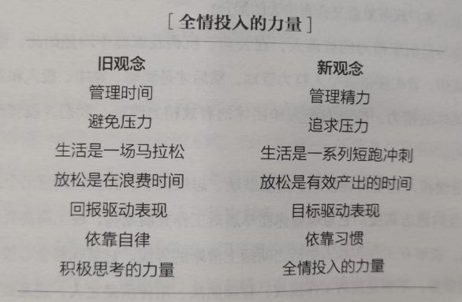
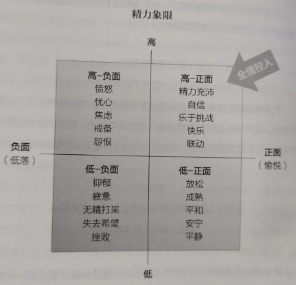
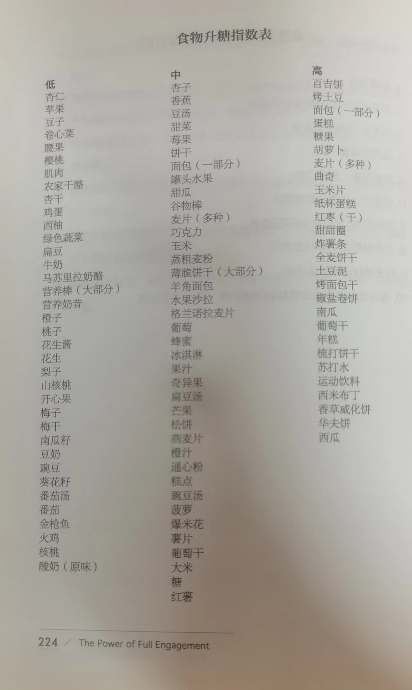
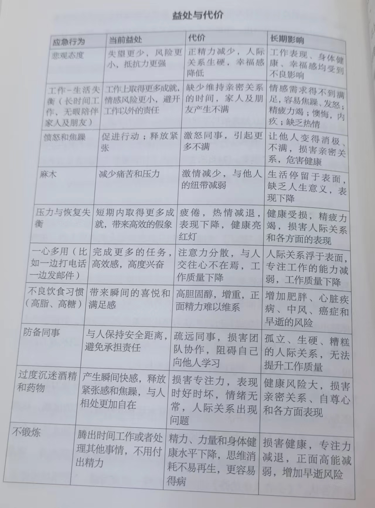

# 《精力管理》阅读笔记

## 第一部分 如何做到全情投入

### 第一章 什么是精力及如何管理
精力就是做事情的能力，包括体能、情感、思维和意志四个方面。

**管理精力，而非时间，是高效表现的基础**

如何保持最佳表现，同时又不损害健康、幸福和对生活的热情？

**_你一定要全情投入!_**

现象：

大多数专业运动员每年得以享受4~5个月的淡季休假。经过数月的高压力、高强度的竞技比赛，淡季休假是运动员休整、疗伤和成长的重要时期。相反，普通人的“淡季休假”加起来也不过一年几周的假期。即使在
休假期间，你也不见得完全在休息和恢复，因为总需要抽出时间回复邮件、查收语音信息，思考下一步的工作。

#### 精力管理的四个原则
一、调用四种独立且相关联的精力源：体能、情感、思维和意志

【身心合一】

体力的首要特征由力量、耐力、灵活性和恢复力组成。
这些也同样是情感、思维和意志的特点。例如，身体层面的
灵活性指的是肌肉可以适应大幅度的运动。拉伸运动可以增
强身体的灵活性。

这些概念在情感层面同样适用。情感的灵活性指可以在
多种情绪层面中自如恰当地转换，而非僵硬或防备地回应外
界。情感的恢复力是指从失望和沮丧中恢复的能力。

思维的耐力可以衡量保持专注的能力，而思维的灵活性表
现在人们可以在理智和直觉间切换，并接受多重角度的观点。

意志的力量反映在一个人最深层面的价值坚守里，无论
环境如何变化，甚至当坚守价值观会导致个人牺牲。精神的
灵活性则表现在对不同价值观和信仰的包容，只要它们与人
无害即可。

二、因为使用过度和使用不足都会消耗精力，必须时不时更新精力以平衡消耗

**_想要保持生命的跃动，我们必须学习如何有节奏地更新和消耗精力_**

三、为了提高能力，我们必须突破自己的惯常极限，模仿运动员进行训练。

**_我们锻炼情感、思维和意志能力，采用的是与锻炼体能相同的方法_**

四、积极的精力仪式习惯，即细致具体的精力管理方法，是全情投入、保持高效表现的诀窍。

**_逐渐成为自然的积极仪式习惯，扎根于我们的深层价值观_**

#### 精力管理的步骤：目标-事实-行动

**_领导者是团队精力的统筹人。他们首先要具备个人的精力管理技巧，然后才能调动、集中、投入和维持团队的集体精力。_**

### 第三章 高效表现有节奏——劳逸结合的平衡

**_精力简单来讲就是做事的能力，人类最基本的需求是精力的消耗与恢复。_**

情感的深度和适应力取决于外界交往的积极程度和内省习惯。思维的敏锐度会因为缺乏思维挑战而衰退。意志精力依赖于不断温习深层价值取向，为自我行为负责。

全情投入需要在各个方面培养精力消耗和精力再生的动态平和。**_我们称之为有节奏的波动，代表了生命的本质脉动。我们是波动世界内的波动个体。节奏性存在于我们的基因中。_**

#### 利用碎片时间见缝插针地休息

最佳选手们在两轮比赛期间有固定的行为模式，包括得分后
走回基线时头和肩膀如何摆正，视线看向哪里，呼吸模式，甚至自言自语
的习惯等。

吉姆恍然大悟，这些选手利用比赛的间隙力争最大限度恢复体力，而许多排名靠后的选手根本没有恢复体力的习惯。在监测顶级选手的心率时，他又有了其他发现。得分之后间的16~20秒内，顶级选手的心跳竟然能够
降至每分钟20次。通过建立高效的体力恢复机制，这些动员能够在极短的时间内完成精力再造。普通选手没有相应的赛间习惯，在整场比赛中心率都停留在较高的水平，因此身体很难支撑下来；而顶尖选手会利用细小
的习惯更有效地恢复体力，为赢得下一分做好准备。

#### 这个世界憎恶休息

由于我们习惯于反天性而为，无视自然赋予的节奏，因而有意地划出工作和休息的界限更为重要。我们必须学会为一天画上休止符，强迫自己在固定的时间离开跑道，停止处理信息，把目标从工作成果转向精力恢复。摩尔艾德把它称为“时间茧蛹”。韦恩·穆勒在力作《安息日》中写道：

我们越是忙碌，越会高看自己，认为自己对他人来说不可或缺。我们无法陪伴亲人朋友，不知疲倦，没日没夜，只管四处救火，不给自己留下喘息的时间。这就是现代社会的成功典型。

穆勒说，我们已经淡忘了诗篇23篇中简单又深刻的道理：“他使我躺卧在青草地上，领我在可安歇的水边。他使我的灵魂苏醒。”不时休息会带给我们重新投入的热情。

为了提升能力，我们需要系统性地增大压力，随后得到充分休息。提升肌肉极限，就要说到“超量补偿”的概念。若现有的肌肉力量不足以达到要求，身体就会通过制造
更多肌肉纤维来应对下一次刺激。
#### 精力超支怎么办

**_通过超极限消耗精力并有效恢复，我们会在各方面成长_**

同理，我们发现情感、思维和意志层面的“肌肉”也有增长空间。人们从本能上抗拒走出自己的舒适圈。恒定性是一种平衡，是维持生理现获的表现。一旦我们挑战这种平衡，就会触发警报系统，提醒我们正在进入未知领域，敦促我们返回安全地带。在遇到真正的危险时，这种警报非常有用，有助于我们自我保护。因此即使是为了塑造肌肉，我们也需要冒着受伤的危险。但如果停留在正常范围内使用肌肉，肌肉永远不会增长。

**_拓展能力需要为了长期回报接受短期不适_**

## 第二部分 精力管理的四个来源

### 第四章 体能精力——为身体添柴加火

呼吸、饮食和睡眠

选择升糖指数低的食物同样重要。升糖指数用以测量糖分从食物进入血液的速度(详见《实用资料》中食品升糖指数举例)。缓慢释放的糖分能够提供更稳定的精力。一顿低升糖指数的早餐可以提供高效并持久的精力，例如全麦食物、蛋白质和低糖水果——草莓、梨子和苹果等。相反，高升糖指数的食物如松饼和甜麦片短期内可以激发精力，但30分钟后精力水平就会显著下降。即使是传统意义上的健康早餐——不涂黄油的面包圈和一杯橙汁——升糖指数也很高，不能帮助人们较好地维持精力。

美国航空航天局在对抗疲劳的实验中发现，小睡40分钟效能可提高34%,并达到完全的清醒。哈佛大学研究员也发现，参加多项任务的受试者精力可能会降低50%，而只需午睡1个小时就能重新达到效能顶峰。世界很多领导人物都清楚地了解小憩的重要价值，其中就包括温斯顿·丘吉尔：

你必须在午餐和晚餐之间抽空睡一会儿，别无他法。脱下衣服躺在床上，这就是我的习惯。不要认为自已在白天睡一会儿就会耽误工作，这是毫无想象力的人才有的愚蠢想法。你总会收获更多。你能把一天当作两天用一至少是一天半，我敢肯定。战争开始后，我也必须保证白天的休息。只有这样，我才能完全担负起自己的责任。

**_夜晚工作的时间越长、越连续、结束的越晚，你会变得越低效，也更容易犯错误。_**

间歇训练可以增大精力的容量，是身体承担更多压力并且更加高效的恢复。有时候比稳态训练效果好。

### 第五章 情感精力——把威胁转化为挑战

如何获得正面情感：

转换频道、所有能带来享受、满足和安全感的活动都能够激发正面情感。

### 第六章 思维精力——保持专注和乐观

**_最有益于全情投入的思维精力是现实乐观主义——看清事物真相，却仍朝目标积极努力。_**

#### 在放松中思考
神经外科专家罗杰斯佩里获得诺贝尔奖，他揭示了大脑左右半球在信息处理方面存在的本质差别。左半球坐落着语言神经，有条理、按次序地工作，通过逻辑推演得出结论。斯佩里突破性地发现：大脑右半球拥有独特的能力，却常常被低估，它更檀长视觉化和空间概念，有更强的全局观，能将事物的部分与整体联系起来。由于右半球不如左半球那样单线化、对时间敏感，因此它更容易凭借直觉和顿悟处理问题。

斯佩里的发现解释了灵感为何往往发生在最不刻意寻找答案的瞬间。同样，间歇地让右脑主持大局，可以让我们从占据我们多数工作时间的左脑理性分析模式中脱离，得到有效恢复。

创造的过程本身具有波动性。从19世纪末的德国生理学家和心理学家赫尔曼·赫姆霍兹开始，许多学者都在尝试定义创造活动的步骤。现在最为广泛接受的是五步论：洞察、汲取、孵育、启示和验证。在《调动正确的大脑》和《唤醒内心的艺术家》中，作家、艺术教授贝蒂·爱德华兹敏锐地指出，创造需要调动左右半脑交替思考。

五个步骤中，有两个明显需要使用左半脑的逻辑化和分析能力：汲取，即依照系统的步骤从众多信息来源中收集有用信息，最后一步一验证，即依靠分析和整理，将创造成果翻译成条理分明、通俗易懂的语言。其他三个步骤——洞察（灵感）、孵育（斟酌）和启示（突破）都与右脑相关，并且经常在我们无意寻找答案或解决方法时发生。爱德华兹称其为“边缘型思考”。“在这些阶段，创造大部分是无意识发生的，而且通常产生在左脑有意识地、理性地寻求解决方案之后。”简而言之，创造的最高形式依靠的是投入与抽离、思考与放松、活跃与休息之间有节奏的交替。等式的两边都很重要，缺少任何一项等式都不能成立。

持续挑战大脑可以预防老龄化思维衰退。

### 第七章 意志精力——活出人生的意义

知晓生命的意义方能忍耐一切。

## 第三部分 精力管理训练系统

### 第八章 明确目标——知道什么最重要才能全情投入

外在激励实际上会损害内在激励。

研究员马克·莱珀和大卫·格林观察了一群幼儿园的孩子玩要，分别确定他们最喜欢的活动。每当孩子们做自己喜欢的游戏时，研究员都会奖励他们。孩子们的兴趣一旦与外部奖励联系起来，很快就全面消退了。在另外一项研究里，成年人每次完成拼图都会受到奖励。结果，像孩子们一样，他们对于拼图的兴趣也持续下降很显然，人们可以被物质奖励或外部激励所驱使；但是，只有在自由选择并享受事物本身的情况下人们才会表现出更多热情，从中获得更多乐趣。

**_如果缺乏强烈的使命感，我们很容易迷失在生活无常的风暴里_**

**_体现在行为中的价值观才是美德_**

### 正视现实
回避现实会消耗大量精力。

《平静祷文》是精力管理理想状态的完美入门指导：“上帝，请赐子我平静，接受我无法改变的；请给予我勇气，改变我能改变的；请赋子我智慧，分辨这两者的区别。”我们耗费巨大的精力担优无法控制的人和事，而更好的选择是，将精力集中在可以切实改变的事物上。面对现实会帮助我们认清两者的区别。

**_自我欺骗==(客观事实=自己的观点)_**

### 付诸行动

面对的困难越大，人们越容易退回旧日的生活习惯，因此良好的习惯非常重要。